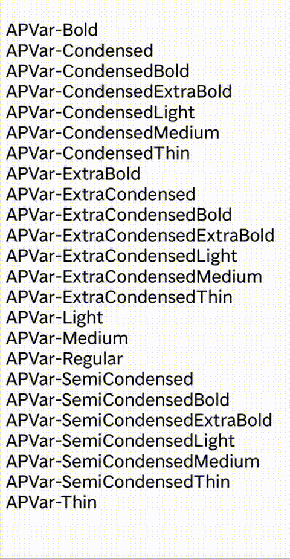

# Fix SVG Fonts for Illustrator: 
## fixSvgFonts.jsx

Trying to resolve the issue where Adobe Illustrator does not always matches the font-family name from SVG files, even though browsers and other viewers do. 

With this solution we enforce precision that Illustrator’s SVG importer does not guarantee.

This script helps restore proper font rendering in SVG files opened in Adobe Illustrator.  
It works by applying available PostScript fonts to text elements, based on group `id`s in the SVG structure.

Note: This solution uses a slightly modified SVG file. We modified the SVG file by adding `<g id="<PostScriptName>">` around the `<text></text>` as meta data for Illustrator. Illustrator interprets <g> as Group with the id as it's name. Inside the Group is our TextFrame with textFont. We then apply the exact PostScript taken from Group.name to it, and remove the parent Group after it's set.

Adding `<g id="<PostScriptName>">` in the SVG could be done by MC. Or automatically by script when interpreting the SVG before opening it. Because we can identify each text by its class with the PS name in it. This requires directly manipulating the DOM which can not be done be done in ExtendScript. I suggest we let CEP (or UXP) handle this inside the MC Extension - or MC adds the `<g>` already in the source SVG.

In our example we run the script over the opened SVG, we do not interpret the svg, we modify the Illustrator document. 

## What It Does

- Opens an `.svg` file via dialog
- Finds groups with `id` names matching PostScript font names (e.g. `APVar-ExtraCondensedBold`)
- Applies the matching font to any `text` elements inside
- Optionally removes the wrapper group after applying the font

## How to Use

0. [Download AP_VAR_ALL.svg] Find it here
1.  **Open Adobe Illustrator**
2.  **Run the script**  
    Copy fixSvgFonts.jsx to /Applications/Adobe Illustrator <version>/Presets.localized/en_US/Scripts"
    or
    Go to `File > Scripts > Other Script...` and choose `FixSvgFonts.jsx`
3. **Select an SVG file: /svg/AP_VAR_ALL.svg**  
    The script will:
    - Open the file
    - Apply fonts to each text object based on the surrounding group’s ID
4.  Fonts should now be correctly applied.

## To do's
- Test with actual svg map (with added `<g id="<PostScriptName>">`)

## APVar from Exposed Font List for testing purposes

`for (var i = 0; i < app.textFonts.length; i++) {
  var f = app.textFonts[i];
  $.writeln(f.name + " | family=" + f.family + " | style=" + f.style);
}`

APVar-Bold | family=AP Var | style=Bold  
APVar-Condensed | family=AP Var | style=Condensed  
APVar-CondensedBold | family=AP Var | style=Condensed Bold  
APVar-CondensedExtraBold | family=AP Var | style=Condensed ExtraBold  
APVar-CondensedLight | family=AP Var | style=Condensed Light  
APVar-CondensedMedium | family=AP Var | style=Condensed Medium  
APVar-CondensedThin | family=AP Var | style=Condensed Thin  
APVar-ExtraBold | family=AP Var | style=ExtraBold  
APVar-ExtraCondensed | family=AP Var | style=ExtraCondensed  
APVar-ExtraCondensedBold | family=AP Var | style=ExtraCondensed Bold  
APVar-ExtraCondensedExtraBold | family=AP Var | style=ExtraCondensed ExtraBold  
APVar-ExtraCondensedLight | family=AP Var | style=ExtraCondensed Light  
APVar-ExtraCondensedMedium | family=AP Var | style=ExtraCondensed Medium  
APVar-ExtraCondensedThin | family=AP Var | style=ExtraCondensed Thin  
APVar-Light | family=AP Var | style=Light  
APVar-Medium | family=AP Var | style=Medium  
APVar-Regular | family=AP Var | style=Regular  
APVar-SemiCondensed | family=AP Var | style=SemiCondensed  
APVar-SemiCondensedBold | family=AP Var | style=SemiCondensed Bold  
APVar-SemiCondensedExtraBold | family=AP Var | style=SemiCondensed ExtraBold  
APVar-SemiCondensedLight | family=AP Var | style=SemiCondensed Light  
APVar-SemiCondensedMedium | family=AP Var | style=SemiCondensed Medium  
APVar-SemiCondensedThin | family=AP Var | style=SemiCondensed Thin  
APVar-Thin | family=AP Var | style=Thin  

APVar-Bold  
APVar-Condensed  
APVar-CondensedBold  
APVar-CondensedExtraBold  
APVar-CondensedLight  
APVar-CondensedMedium  
APVar-CondensedThin  
APVar-ExtraBold  
APVar-ExtraCondensed  
APVar-ExtraCondensedBold  
APVar-ExtraCondensedExtraBold  
APVar-ExtraCondensedLight  
APVar-ExtraCondensedMedium  
APVar-ExtraCondensedThin  
APVar-Light  
APVar-Medium  
APVar-Regular  
APVar-SemiCondensed  
APVar-SemiCondensedBold  
APVar-SemiCondensedExtraBold  
APVar-SemiCondensedLight  
APVar-SemiCondensedMedium  
APVar-SemiCondensedThin  
APVar-Thin  